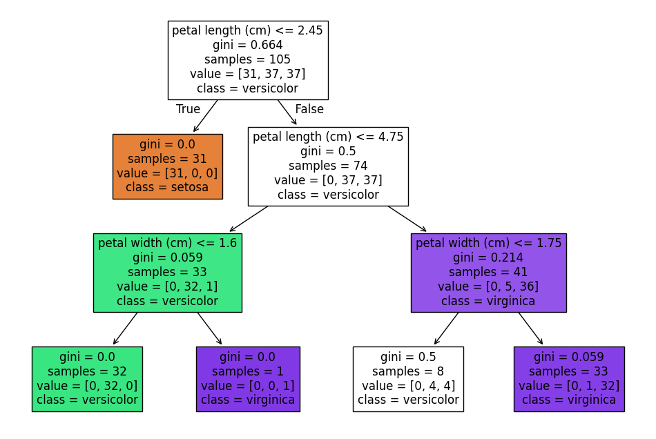
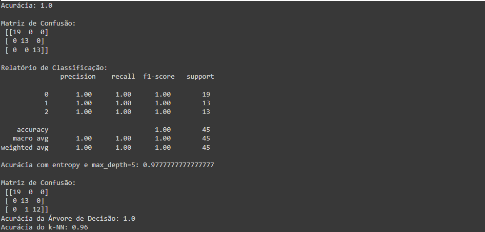

# Treinamento e Avaliação de Árvore de Decisão no Dataset Iris

## Descrição do Código
O objetivo deste código é construir, treinar e avaliar uma **árvore de decisão** utilizando o **dataset Iris**, um conjunto clássico de dados para classificação. Além disso, o código compara a performance do modelo com uma suposição de acurácia obtida por um classificador **k-NN (k-Nearest Neighbors)**.

## Etapas do Código

1. **Importação de Bibliotecas**  
   Foram utilizadas bibliotecas essenciais para aprendizado de máquina e visualização, como `scikit-learn` e `matplotlib`.

2. **Carregamento do Dataset Iris**  
   O dataset Iris é carregado e dividido em variáveis explicativas (`X`) e a variável-alvo (`y`).

3. **Divisão dos Dados**  
   Os dados são divididos em dois subconjuntos:  
   - **Treinamento**: 70% dos dados  
   - **Teste**: 30% dos dados  
   O parâmetro `random_state` é utilizado para garantir a reprodutibilidade.

4. **Treinamento da Árvore de Decisão**  
   A primeira versão do modelo é treinada utilizando:
   - Critério: `gini`
   - Profundidade máxima: 3  
   Isso ajuda a evitar overfitting (ajuste excessivo).

5. **Visualização da Árvore**  
   A árvore de decisão é plotada utilizando a função `plot_tree`, com detalhes sobre os recursos e as classes.

6. **Previsão e Avaliação**  
   As previsões são feitas no conjunto de teste, e três métricas principais são calculadas:
   - **Acurácia**: Percentual de previsões corretas.
   - **Matriz de Confusão**: Matriz que mostra a distribuição de previsões corretas e incorretas.
   - **Relatório de Classificação**: Exibe métricas como precisão, recall e F1-score para cada classe.

7. **Modelo Alternativo com 'entropy' e max_depth=5**  
   Outra árvore é treinada com um critério diferente (`entropy`) e profundidade maior (5). A acurácia e a matriz de confusão são recalculadas para comparação.

8. **Comparação com Classificador k-NN**  
   A acurácia da árvore de decisão é comparada com um valor hipotético de acurácia obtido pelo algoritmo k-NN (96%).

## Resultados Obtidos

- **Árvore com Gini e max_depth=3**  
  - Acurácia: *variável calculada no momento da execução*  
  - Matriz de Confusão e Relatório de Classificação exibem detalhes das previsões.

- **Árvore com Entropy e max_depth=5**  
  - Acurácia: *variável calculada no momento da execução*

- **Comparação com k-NN**  
  - Acurácia da Árvore de Decisão: *valor calculado*  
  - Acurácia do k-NN: 96%

